**LABORATORIO N°1**

Integrantes:                                                                                                                   Grupo 4

- Cárdenas Palacios, Leonardo Gustavo
- Espinoza Cerna, Alex
- Inocente Caro, Miguel Anderson

Requisitos del ordenador usado

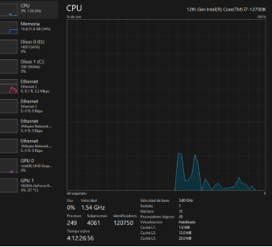

Instalando Virtual Box

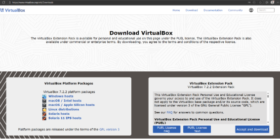

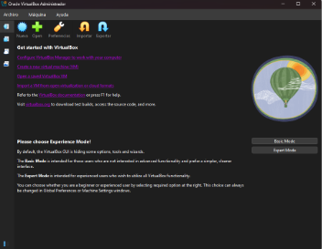Ejecutar el instalador de Virtual Box

Luego de dar a la opción de Archivo-Preferencias- General, elegimos llamar al archivo por defectro con el nombre de InteligenciaNegocios

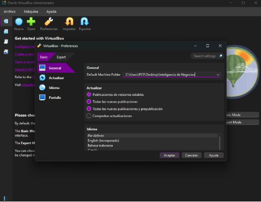

Importacion del HDP Sandbox

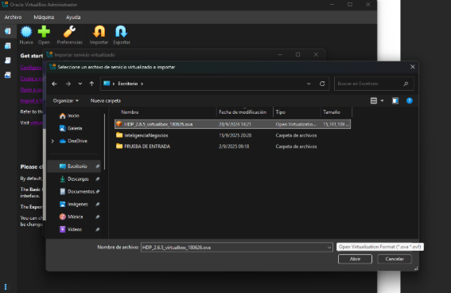

Infromacion por defecto

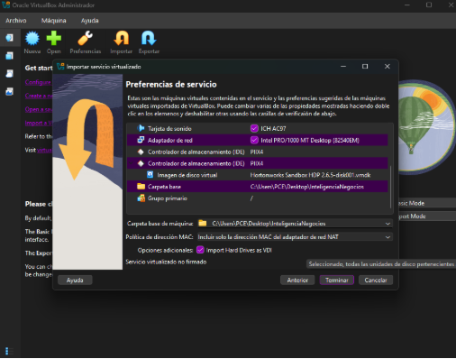

Configurando la red

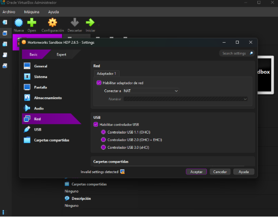

Asignando recursos

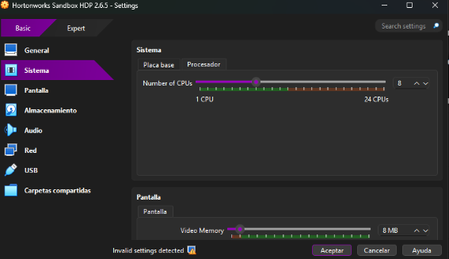

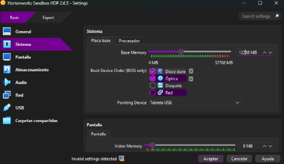

Arrancando el sistema\
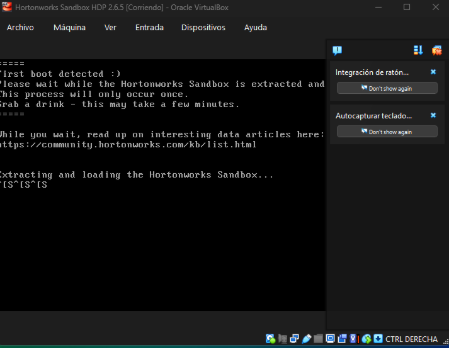

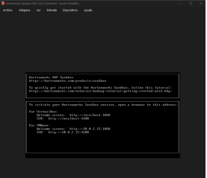

Accediendo al Ambari desde la dirección: \
\
http://localhost:1080 

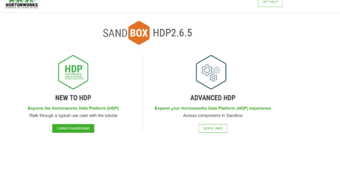

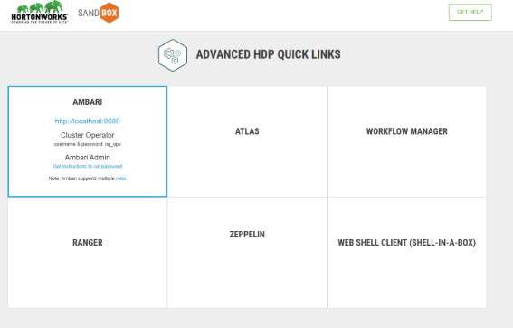

Para acceder al root\

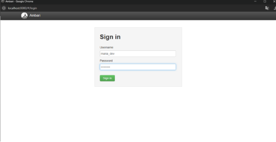

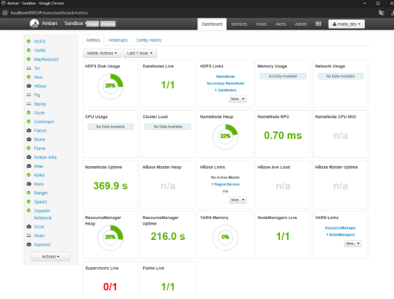

Servicios principales activos 

HDFS, YARN, Hive, Spark, Zeppelin, como se puede observar en pantalla.

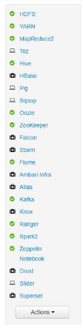

Ingresamos a la opción del Web Shell Client

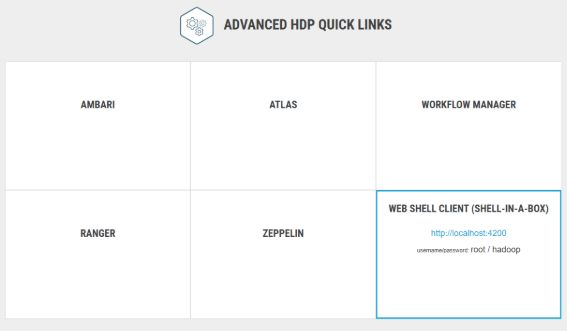

Comrpobacion inicial

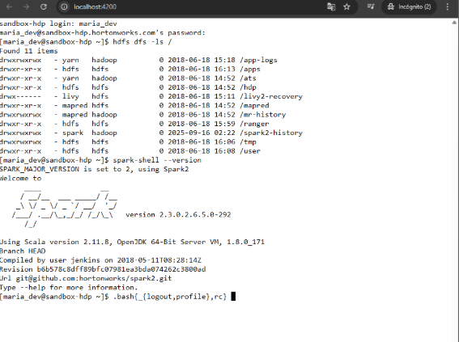

Subiendo archivo csv cuyo nombre es flights.csv y le damos opción files view

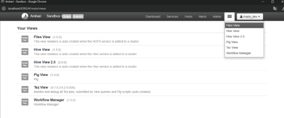

La dirección es user/admin/datasets/flights.csv como se observa en pantalla\
\
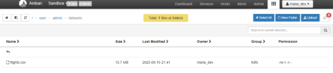

Entramos a la opción Hive view para ingresar la query 

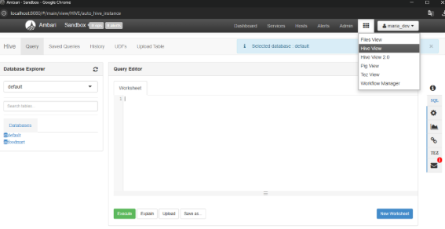

Cargamos las tablas

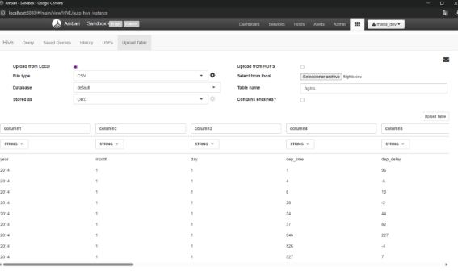

Usamos el siguiente códigopara crear la tabla externa en Hive.

\
CREATE EXTERNAL TABLE flights (

`  `year STRING,

`  `month STRING,

`  `day STRING,

`  `dep\_time STRING,

`  `dep\_delay STRING,

`  `arr\_time STRING,

`  `arr\_delay STRING,

`  `carrier STRING,

`  `tailnum STRING,

`  `flight STRING,

`  `origin STRING,

`  `dest STRING,

`  `air\_time STRING,

`  `distance STRING,

`  `hour STRING,

`  `minute STRING

)

ROW FORMAT DELIMITED

FIELDS TERMINATED BY ','

STORED AS TEXTFILE

LOCATION '/user/admin/datasets/flights.csv/'

TBLPROPERTIES ("skip.header.line.count"="1");

Una vez creado la  tabla externa en Hive se utiliza cuando deseas que los datos permanezcan fuera del control directo de Hive. Y probamos la query select\*from flights para comprobar el funcionamiento.

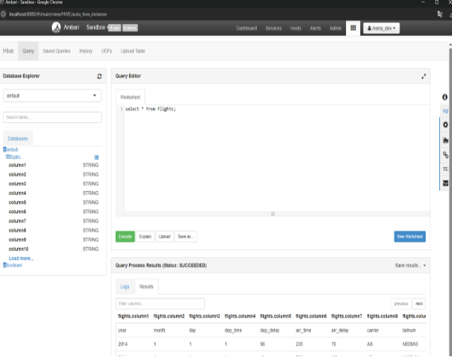

Se genera la siguiente tabla:

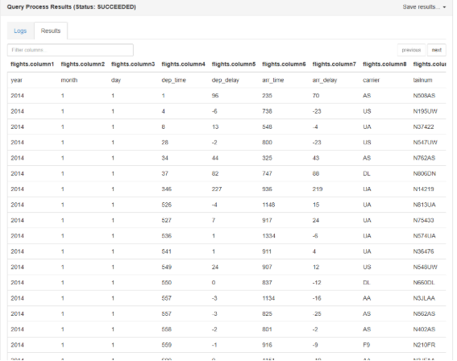
